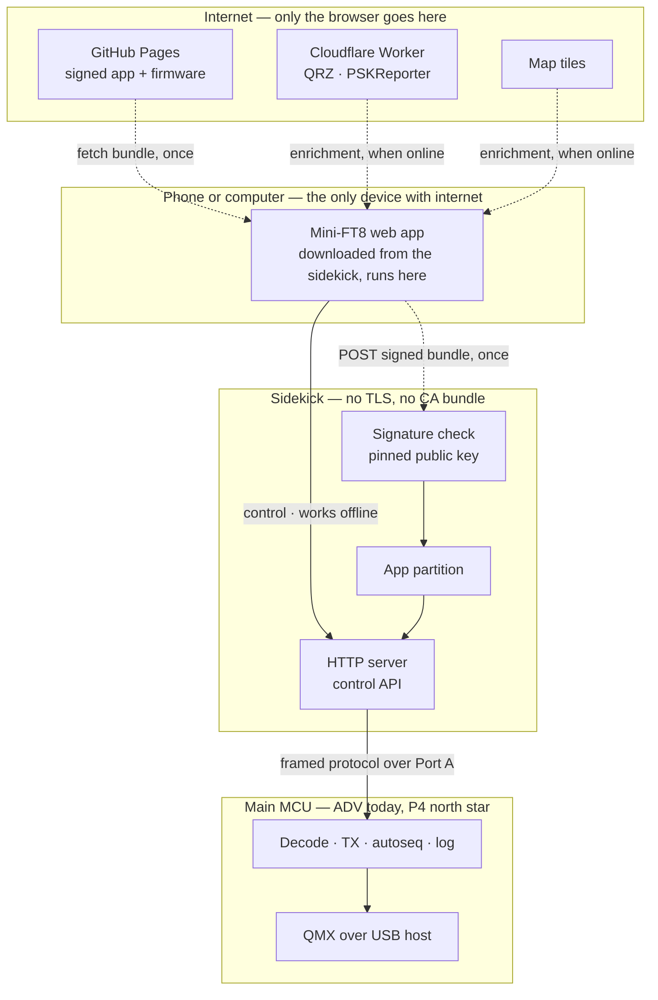
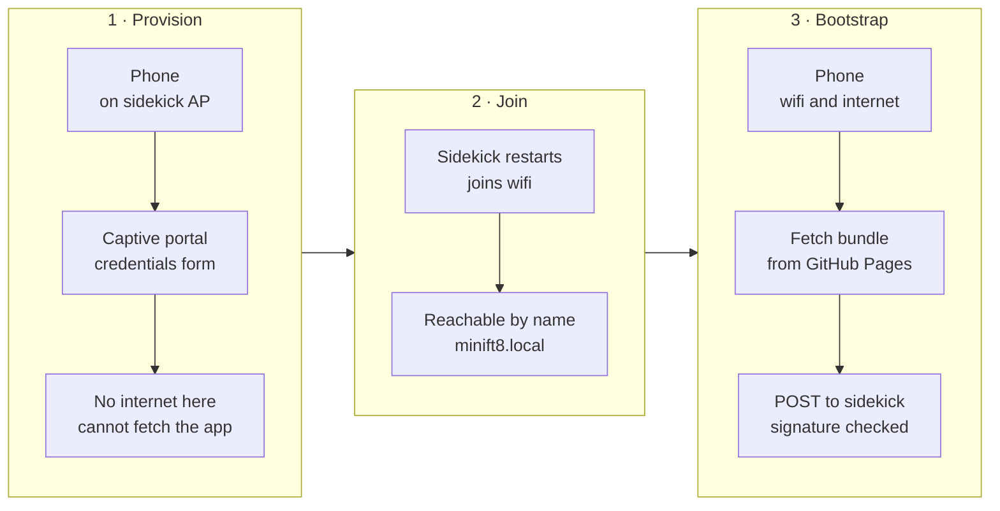

# RFC 0004: Headless Mini-FT8 — the phone is the UI, the sidekick is a peripheral

* **Status:** Draft. Design agreed in chat 2026-09-10; nothing here is built. Supersedes nothing; extends [RFC 0001](0001-ble-companion.md) §5.0/§5.2d, which established WiFi-plus-browser as the phone path and moved sidekick updates from a PORTA push to an HTTPS pull.
* **Author / Lead:** Jeff Kalikstein, KB2SLO
* **Covers:** where the web application lives, how it is delivered and trusted, how the browser reaches the radio, and what crosses the sidekick-to-main link.
* **Does not cover:** the ESP32-P4 port itself ([I27](../ROADMAP.md), gated on B26), the decode pipeline, or anything about the ADV's existing screen and keyboard — which this design must not depend on and does not remove.
* **Ask:** do not start the web application before the sidekick-to-main protocol exists. The app is the visible half; the protocol is the half that makes it possible.

---

## 1. Why

Mini-FT8's UI is a 240-pixel screen and a thumb keyboard. The north star ([I27](../ROADMAP.md)) is a
headless two-MCU radio with no screen and no keyboard at all, where a phone is the only interface. That is
not a skin over the current UI — it means every operator-reachable function has to leave the device and
arrive in a browser, and the transport that carries it has to be designed rather than grown.

Three constraints were settled before any of this was drawn, and they decide most of what follows:

1. **Offline field operation is a requirement.** POTA sites and summits routinely have no cell service. A
   radio whose UI lives on the internet is a radio with no UI on a summit.
2. **Internet may be required for initial station setup.** Not for operating. This is what makes the design
   affordable — the firmware does not need to carry a full UI as a fallback.
3. **No dependency on the ADV's keyboard or screen.** A build that works on P4 must also work on ADV, so the
   protocol is specified against the application, not the board.

## 2. The inversion this rests on

**The browser is the internet-connected device; the sidekick is a local peripheral.**

That is the whole idea, and everything good here follows from it. The phone already has a cellular radio, a
TLS stack, a trust store, a screen, and a browser. The sidekick has none of those and would have to grow
them at a cost measured in flash, maintenance, and failure modes. So it does not: **third-party services are
reached by the phone, never by the device.** QRZ, PSKReporter and map tiles are the browser's problem.

Taken to its conclusion, the sidekick never speaks TLS **at all** — see §4.

Dashed edges require internet. Solid edges work without it. **Every edge below the phone is solid**, and
keeping it that way is the property to defend as this grows: the moment the sidekick needs one HTTPS call,
the TLS stack, the CA bundle and its expiry come back.

## 3. Where the application lives

**The sidekick serves the whole application; it is not bundled into firmware.**

Both halves of that matter and they were argued separately.

**Served by the sidekick, not loaded from the internet**, because of constraint 1. A page served from
`https://kb2slo.kalikstein.com` *cannot* reach `http://minift8.local` — browsers block active mixed content
with no exception for private addresses, so an internet-hosted app cannot talk to the device at all. The
inverse works: an HTTP page may load HTTPS subresources. But an app that fetches itself from the internet
each session is an app that does not exist on a summit. Serving it locally also makes the whole question
moot, since the app and the API are then same-origin.

The cost is that the page is a **non-secure context**. We lose service workers, the geolocation API, and
Web Serial/Bluetooth. `localStorage` and `fetch` to HTTPS survive. Losing geolocation is the one that stings
— auto-grid from the phone would have been nice — and it is the price of not owning a certificate for a name
that only resolves on one LAN.

**Not bundled into firmware**, because the app should ship on its own cadence and because firmware flash is
the wrong place for a UI that will change weekly. It lives in its own partition at the 1.9 MB free tail of
the 8 MB part, above `ota_1`, leaving both OTA slots and `nvs` untouched. Assets are stored pre-compressed
and served with `Content-Encoding: gzip`; a disciplined app is 100–300 KB gzipped, so the budget is
comfortable but not unlimited. **No bundled map tiles. No heavyweight framework.**

The consequence, accepted deliberately: **a sidekick that has never had internet has no application.** It can
provision WiFi and accept a bundle, and that is all. Constraint 2 is what makes this acceptable.

## 4. How the application and firmware are delivered

**The phone relays; the device verifies.**

1. Phone opens `http://minift8.local/` — the sidekick serves a small bootstrap page out of firmware.
2. That page fetches the signed bundle from `https://kb2slo.kalikstein.com` (HTTP page, HTTPS fetch: allowed,
   and we control CORS on our own domain).
3. The page **POSTs the bundle to the sidekick**, which verifies its signature and writes it to the app
   partition.
4. Firmware travels the same path to an OTA endpoint.

This is the conclusion of §2 and it deletes an entire class of work: **no TLS stack on the device, no CA
bundle to maintain as roots rotate, no certificate expiry, no clock dependency for certificate validity.**
Measured earlier: TLS costs ~116 KB of flash on this target. It also resolves two of the three decisions
[RFC 0001](0001-ble-companion.md) §5.2d left open — CA maintenance stops existing, and the choice between
embedding the full app or a bootstrap resolves to *bootstrap*.

**It forces the third decision, and that is the trade.** TLS was authenticating the *source*, and a plain
POST endpoint on a LAN authenticates nothing. So **images must be signed and the signature verified on the
device** against a public key baked into firmware. ESP-IDF supports signed-app verification without enabling
full secure boot, so this is a supported path rather than one we invent. Signing is no longer optional: it is
the mechanism that replaces TLS trust. A pinned public key that never expires, in place of a CA bundle that
does, is a good trade.

**Version pairing.** Keeping the app out of firmware brings back the skew problem that bundling would have
solved: a downloaded app can outrank the API of the firmware serving it. The manifest therefore pairs them —
each bundle declares the minimum sidekick API version it needs — and the sidekick **refuses a bundle it
cannot serve**, saying so plainly rather than accepting it and failing later. Cheap to design in, nasty to
discover in a field.

## 5. Provisioning and first run

The phone cannot fetch a bundle while joined to the provisioning AP, because a captive portal generally takes
the default route and leaves the phone with no internet. As drawn, bootstrap therefore needs a network that
has internet.

**The phone's own hotspot resolves this, and it is a documentation answer before it is an engineering one.**
If the sidekick joins the operator's Personal Hotspot, the phone has cellular internet *and* is on the same
LAN as the sidekick — stages 1 and 3 collapse, a factory sidekick can be set up on a summit, and QRZ lookups
work in the field. The existing constraint applies: iPhone hotspots need *Maximize Compatibility* on, because
this radio is 2.4 GHz only.

[I19](../ROADMAP.md) — an AP whose DHCP omits the router and DNS options so the phone keeps its cellular
route — remains the answer for the AP-mode fallback where there is no cell signal at all. It is no longer on
the critical path, because in that situation the operator is offline regardless.

## 6. The sidekick-to-main protocol

**This is the critical path and the least designed part of the system.** Port A carries a version beacon
today. Everything the application needs crosses that link: decodes at slot cadence, TX control, configuration
read and write, and log access.

Requirements:

* **Framed messages over a byte pipe**, with framing that does not assume a stream. This is what keeps the
  transport swappable — see [B47](../ROADMAP.md), which defers the UART-versus-I2C choice deliberately. The
  application, the control API and this document must not depend on which wins.
* **Board-agnostic.** Specified against the application — decode, transmit, autoseq, config, log — never
  against board hardware, so an ADV build and a P4 build present the same surface.
* **Versioned**, for the same reason §4 pairs app and API.
* **Coexists with what is already on the bus.** `main/porta.cpp` currently arbitrates Port A between a GPS
  and the companion via `PortaRole`, a mechanism that exists only because UART makes the port exclusive.

Direction and latency are asymmetric in a way that shapes the design: commands are infrequent and want low
latency; decodes are periodic on a 15-second boundary and tolerate hundreds of milliseconds. A full slot of
decodes is roughly 3 KB, so sustained throughput is a couple of hundred bytes per second.

**Open, to be settled before implementation:** whether the browser-facing channel is polling, SSE, or a
WebSocket. Decodes are a one-way stream and commands are infrequent, so SSE plus POST is simpler and degrades
better on flaky WiFi than a WebSocket — but this deserves its own argument, not a default.

## 7. Who may key the transmitter

A headless radio driven by an unauthenticated local HTTP API means **any device on the network can start a
transmission**, and the licensee is answerable for it. Signing (§4) protects the firmware supply chain; it
says nothing about the control channel. These are different problems and the second one is easy to forget
because the first one sounds like security.

**Decided: a pairing token, minted during provisioning and held by the browser.** Every control request
carries it; requests without it are refused. This is the cheap version and it is proportionate — the threat is
an accident or a nuisance on a home LAN, not a targeted attacker, and the operator can re-provision to rotate
it. Read-only status may remain unauthenticated so a second device can watch without being able to transmit.

**Not decided:** what happens when two paired browsers both try to transmit. A single-writer model is the
likely answer, but multi-client behaviour is unspecified and should not be discovered in the field.

## 8. Third-party services

QRZ's XML API and PSKReporter are built for server-side consumers and predate CORS by a wide margin. **If
they do not send `Access-Control-Allow-Origin`, browser JavaScript cannot call them at all**, regardless of
credentials. That is cheap to verify and should be verified before anything is designed around it, because a
positive result deletes work.

Where a proxy is needed, a **Cloudflare Worker** on the free tier is the answer; 100k requests/day is ample.
One constraint on it: QRZ's XML interface requires a subscriber login, so a Worker holding *the author's*
credentials would have every user of the application operating under one subscription — a terms-of-service
problem the moment a second person runs this. **Users supply their own QRZ credentials and the Worker relays
statelessly.**

Google Maps is a browser API by design and needs no proxy. Its key ships in a static app and must therefore
be referrer-restricted.

## 9. What this becomes

Roadmap rows, sequenced. The protocol gates everything else.

| Row | Scope |
| --- | ----- |
| Protocol | Framed, bidirectional, transport-agnostic messages across Port A (§6). **First.** |
| Transport trial | [B47](../ROADMAP.md) — bench-prove ESP32-S3 as an I2C slave, and bus recovery after a live cable yank. Parallel; must not block. |
| App partition + bootstrap | Partition at the 1.9 MB tail, phone-relayed POST, version pairing (§3, §4). |
| Signing chain | Key handling, CI signing of bundle and firmware, pinned public key on device (§4). |
| Control API + pairing | The API surface and the token (§6, §7). |
| The application | The web app, plus the Worker for QRZ and PSKReporter (§8). |

## 10. Risks

| Risk | Bounding |
| --- | --- |
| The protocol is underestimated | It is treated as the critical path here, ahead of the visible work. If it slips, the application slips with it, and that is the correct order. |
| Non-secure context bites harder than expected | Geolocation and service workers are known losses (§3). A surprise beyond those would reopen the certificate question, which is why §3 records why it was declined rather than merely that it was. |
| App outgrows the partition | 1.9 MB against 100–300 KB gzipped is roughly 6x headroom, and the discipline is stated: no bundled tiles, no heavy framework. If it is ever breached, the fix is a partition change, which costs a USB-C reflash of every device in existence. |
| Signing key handling | The one piece of this with no undo. A compromised key is a firmware supply chain compromise for every deployed device, and there is no revocation path in the design. Its handling belongs in the signing-chain row, not as an afterthought. |
| QRZ/PSKReporter CORS assumption is wrong in either direction | Verify before designing (§8). |
| Two browsers, one transmitter | Named and unresolved (§7). |
