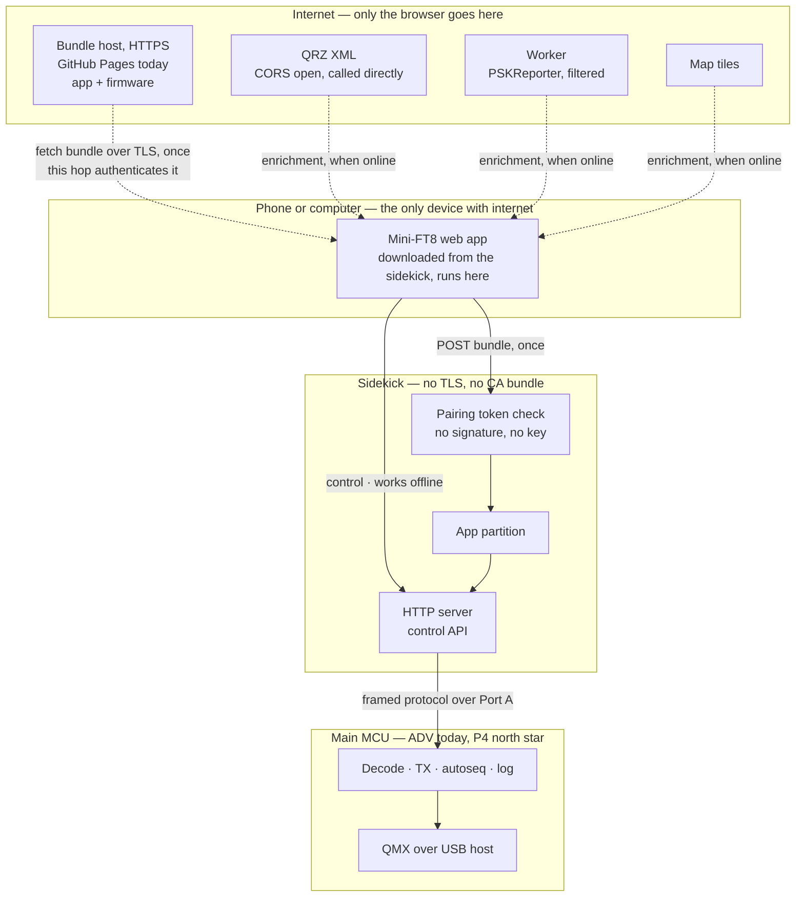
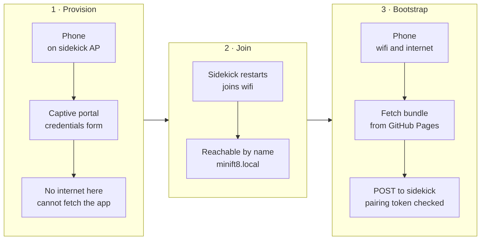

# RFC 0004: Headless Mini-FT8 — the phone is the UI, the sidekick is a peripheral

* **Status:** Draft. Design agreed in chat 2026-09-10; nothing here is built. Supersedes nothing; extends [RFC 0001](0001-ble-companion.md) §5.0/§5.2d, which established WiFi-plus-browser as the phone path and moved sidekick updates from a PORTA push to an HTTPS pull.
* **Author / Lead:** Jeff Kalikstein, KB2SLO
* **Covers:** where the web application lives, how it is delivered and trusted, how the browser reaches the radio, and what crosses the sidekick-to-main link.
* **Does not cover:** the ESP32-P4 port itself ([I27](../ROADMAP.md), gated on B26), the decode pipeline, or anything about the ADV's existing screen and keyboard — which this design must not depend on and does not remove.
* **Ask:** do not start the web application before the sidekick-to-main protocol exists. The app is the visible half; the protocol is the half that makes it possible.

---

## 1. Why

Mini-FT8's UI is a 240-pixel screen and a thumb keyboard. The north star ([I27](../ROADMAP.md)) is a
headless two-MCU radio with no screen and no keyboard at all, where a phone is the only interface. That is
not a skin over the current UI — it means every operator-reachable function has to leave the device and
arrive in a browser, and the transport that carries it has to be designed rather than grown.

Three constraints were settled before any of this was drawn, and they decide most of what follows:

1. **Offline field operation is a requirement.** POTA sites and summits routinely have no cell service. A
   radio whose UI lives on the internet is a radio with no UI on a summit. **Followed to its conclusion
   2026-09-12, which this RFC had not done: a summit has no router either.** The only path from phone to
   sidekick there is the sidekick's own access point, so this constraint does not merely require surviving
   without internet — it requires **the whole application to run over AP mode**. §5 and
   [I19](../ROADMAP.md) each call that "the AP-mode fallback", which is backwards: station mode is the
   convenience case, and AP mode is the one this first constraint names. Nothing in this design may assume AP
   mode is a transient setup state. [B55](../ROADMAP.md) carries the investigation and the list of ways that
   assumption could get baked in before anyone notices.
2. **Internet may be required for initial station setup.** Not for operating. This is what makes the design
   affordable — the firmware does not need to carry a full UI as a fallback.
3. **No dependency on the ADV's keyboard or screen.** A build that works on P4 must also work on ADV, so the
   protocol is specified against the application, not the board.

## 2. The inversion this rests on

**The browser is the internet-connected device; the sidekick is a local peripheral.**

That is the whole idea, and everything good here follows from it. The phone already has a cellular radio, a
TLS stack, a trust store, a screen, and a browser. The sidekick has none of those and would have to grow
them at a cost measured in flash, maintenance, and failure modes. So it does not: **third-party services are
reached by the phone, never by the device.** QRZ, PSKReporter and map tiles are the browser's problem.

Taken to its conclusion, the sidekick never speaks TLS **at all** — see §4.



Dashed edges require internet. Solid edges work without it. **Every edge below the phone is solid**, and
keeping it that way is the property to defend as this grows: the moment the sidekick needs one HTTPS call,
the TLS stack, the CA bundle and its expiry come back.

## 3. Where the application lives

**The sidekick serves the whole application; it is not bundled into firmware.**

Both halves of that matter and they were argued separately.

**Served by the sidekick, not loaded from the internet**, because of constraint 1. A page served from
`https://kb2slo.kalikstein.com` *cannot* reach `http://minift8.local` — browsers block active mixed content
with no exception for private addresses, so an internet-hosted app cannot talk to the device at all. The
inverse works: an HTTP page may load HTTPS subresources. But an app that fetches itself from the internet
each session is an app that does not exist on a summit. Serving it locally also makes the whole question
moot, since the app and the API are then same-origin.

The cost is that the page is a **non-secure context**. We lose service workers, the geolocation API, and
Web Serial/Bluetooth. `localStorage` and `fetch` to HTTPS survive. Losing geolocation is the one that stings
— auto-grid from the phone would have been nice — and it is the price of not owning a certificate for a name
that only resolves on one LAN.

**Not bundled into firmware**, because the app should ship on its own cadence and because firmware flash is
the wrong place for a UI that will change weekly. It lives in its own partition at the 1.9 MB free tail of
the 8 MB part, above `ota_1`, leaving both OTA slots and `nvs` untouched. Assets are stored pre-compressed
and served with `Content-Encoding: gzip`; a disciplined app is 100–300 KB gzipped, so the budget is
comfortable but not unlimited. **No bundled map tiles. No heavyweight framework.**

The consequence, accepted deliberately: **a sidekick that has never had internet has no application.** It can
provision WiFi and accept a bundle, and that is all. Constraint 2 is what makes this acceptable.

## 4. How the application and firmware are delivered

**The phone relays, and the browser's own TLS connection is what proves the source.**

1. Phone opens `http://minift8.local/` — the sidekick serves a small bootstrap page out of firmware.
2. That page fetches the bundle from the bundle host over HTTPS (HTTP page, HTTPS fetch: allowed, and the
   host must send `Access-Control-Allow-Origin` — see the host requirements below).
3. The page **POSTs the bundle to the sidekick**, which checks §7's pairing token, then the manifest's
   per-asset digests as it writes to the app partition.
4. Firmware travels the same path to an OTA endpoint.

This is the conclusion of §2 and it deletes an entire class of work: **no TLS stack on the device, no CA
bundle to maintain as roots rotate, no certificate expiry, no clock dependency for certificate validity.**
Measured earlier: TLS costs ~116 KB of flash on this target. It also resolves two of the three decisions
[RFC 0001](0001-ble-companion.md) §5.2d left open — CA maintenance stops existing, and the choice between
embedding the full app or a bootstrap resolves to *bootstrap*.

**Signing is rejected, decided 2026-09-12.** This section previously required signed images verified against
a public key pinned in firmware, on the reasoning that TLS authenticated the *source* and a plain POST on a
LAN authenticates nothing. The first half is right and the conclusion does not follow. Recorded here with the
argument, not merely deleted, because "add signing" is the reflexive answer and this needs to stay rejected on
purpose:

* **The source is already authenticated, one hop earlier.** Step 2 is an HTTPS fetch the browser validates
  against the public CA system. By the time the bytes reach step 3 they have been proven to come from the
  bundle host untampered. A signature would re-prove what TLS just proved.
* **Every inbound path passes through the operator's own browser.** §2's conclusion is that the device never
  speaks TLS, so it never fetches anything itself — bundle and firmware both arrive by relay. There is no
  route where a signature is the *only* available proof of origin, which is the situation that would justify
  one.
* **The key would share a trust domain with the host, so it would prove nothing extra.** CI signing means the
  private key lives in a GitHub Actions secret. Secrets are not readable in the UI, but any workflow can use
  one and anyone who can push a workflow can exfiltrate it — so the key's security boundary is the GitHub
  account's boundary, which is the same boundary already protecting the host. Whoever can serve a malicious
  bundle can sign it. Making the signature independent would mean an offline key and a manual signing step on
  every app release, buying defence against a GitHub account compromise alone.
* **The cost is permanent and one-way.** A pinned key with no revocation path is a liability for the life of
  every device, which §10 already admitted. Paying it for a duplicate of TLS is a bad trade.

**What the device actually needs is authorization, not authenticity**, and it is a different problem than the
one signing was aimed at: nothing must be able to write the app partition or key the transmitter merely by
being on the LAN. §7's pairing token is that control, and it is cheap — no key custody, no revocation, no CI
signing step. It is therefore built **before** the POST endpoint exists rather than two slices later.

Two things are kept that are easy to mistake for signing. The manifest carries a **SHA-256 per asset**, which
catches a truncated or garbled upload over flaky WiFi — integrity against corruption, not against an
adversary, since whoever supplies the bundle supplies the manifest too. And **version pairing** below is
about skew, not trust. The sidekick's existing `CONFIG_BOOTLOADER_APP_ROLLBACK_ENABLE` already covers an
image that boots but cannot talk, and first install and recovery need physical USB-C through the ADV — so
physical possession remains the real trust anchor, as it already was.

**This is a pre-alpha decision with a stated trigger for revisiting.** It rests on there being one operator
relaying to their own device. Signing earns its cost when content can reach a device by a path that is *not*
the owner's TLS-authenticated browser — distributing built sidekicks to other operators, or an unattended
update path. Reopen it then, with this argument in hand.

### Host requirements, and why CORS is on the critical path

**The design depends on two properties of the bundle host, not on who the host is.** Any static host with
both works; GitHub Pages is the implementation, not the architecture.

1. **HTTPS with a publicly-trusted certificate.** This is the only thing authenticating the bundle, per the
   signing decision above, so it is load-bearing rather than hygiene.
2. **An `Access-Control-Allow-Origin` that lets a plain-HTTP origin read the response.**

**Why the second one matters at all is worth stating, because it looks like a security concern and is not.**
CORS here is a *capability* question. The bootstrap page is an origin (`http://minift8.local`) fetching from
a different origin (the bundle host), so the browser will issue the request but withhold the response body
from our own script unless the host opts in. Nothing is being defended; the browser is simply refusing to let
us read bytes we need to read. And we need to read them because the browser is the courier: mixed content
forbids an HTTPS page from reaching `http://minift8.local` (§3), so the app must be served locally, so it
must first be carried onto the device, and a courier has to be able to read the parcel. Were the sidekick
willing to speak TLS it would fetch the bundle itself and CORS would never arise — that is the ~116 KB and
the CA bundle §2 declined. Cross-origin `` and `<script>` loads need no CORS but yield rendering or
execution, never bytes to re-POST.

Since it is a precondition nobody here controls, it was measured rather than assumed — the same discipline
§8 applied to QRZ, where the answer inverted the assumption. Measured 2026-09-12 with
`Origin: http://minift8.local`:

| Host | `Access-Control-Allow-Origin` | Readable by browser JS |
| --- | --- | --- |
| Pages, `github.io` subdomain | `*` | Yes |
| Pages, custom domain | `*` | Yes |
| Pages, binary asset | `*` | Yes |
| Pages, preflight `OPTIONS` | — (HTTP 405) | Simple requests only |
| GitHub Releases asset | absent | **No** |

Observed behaviour, not documented policy — the same caveat §8 carries for QRZ. Re-check any row with:

```bash
curl -sS -D - -o /dev/null -H 'Origin: http://minift8.local' <url> | grep -i access-control
```

`pages.github.com` is the custom-domain row and `microsoft.github.io` the subdomain row — neither is ours,
because Pages is not yet enabled on this repo; they measure the *platform*, which is the thing being decided.
Two constraints follow, and both are free to adopt now and irritating to retrofit:

* **The bundle fetch must stay a *simple* request**: `GET`, no custom request headers. Pages answers a
  preflight with 405, so anything that triggers one fails. API version and the like belong in the manifest
  body or the URL path, never a request header. This does not touch §7's pairing token, which guards the
  sidekick's own same-origin API.
* **Manifest URLs stay relative to the manifest's own location.** A project-repo Pages site serves under
  `/Mini-FT8/` while a custom domain serves at the root, so absolute paths would break on any move.
* **The bundle host base URL is stored in NVS, not compiled in**, with a build-time default — set alongside
  the WiFi credentials at provisioning. This is what makes host-independence real instead of aspirational: a
  provider swap becomes a config change rather than a reflash of every device. It is a **token-guarded
  write** like any other config (§7), because a settable bundle host is otherwise the most attractive thing
  on the device for a LAN attacker to repoint.

**Host-independence has one rider: the CORS header is per-provider and must be measured, not assumed.** A
provider that fails requirement 2 breaks the relay outright — the browser fetches and the script cannot read
— so the `curl` above is the gate on adopting any new host, including our own. Note the two hostnames that
are easy to conflate: `minift8.local` is the *sidekick's own* mDNS name and stays in firmware; the bundle
host is the separate, NVS-stored one.

**`kb2slo.kalikstein.com` is a later step and costs nothing to defer.** CNAMEd onto the same Pages deployment
it is a DNS record, a `CNAME` file and GitHub's own certificate. The measurement survives the move because
the custom-domain row above *is* a custom domain on Pages; only the NVS base URL changes.

**Releases cannot be reused, which is why this is new infrastructure rather than a reuse.** CI already
publishes firmware as a GitHub Release asset (`continuous`), and that path sends no
`Access-Control-Allow-Origin` at all — so it is unreachable from browser JS and cannot carry the bundle.
Recorded because it is the obvious shortcut and it does not work.

**Version pairing.** Keeping the app out of firmware brings back the skew problem that bundling would have
solved: a downloaded app can outrank the API of the firmware serving it. The manifest therefore pairs them —
each bundle declares the minimum sidekick API version it needs — and the sidekick **refuses a bundle it
cannot serve**, saying so plainly rather than accepting it and failing later. Cheap to design in, nasty to
discover in a field.

## 5. Provisioning and first run



The phone cannot fetch a bundle while joined to the provisioning AP, because a captive portal generally takes
the default route and leaves the phone with no internet. As drawn, bootstrap therefore needs a network that
has internet.

**The phone's own hotspot resolves this, and it is a documentation answer before it is an engineering one.**
If the sidekick joins the operator's Personal Hotspot, the phone has cellular internet *and* is on the same
LAN as the sidekick — stages 1 and 3 collapse, a factory sidekick can be set up on a summit, and QRZ lookups
work in the field. The existing constraint applies: iPhone hotspots need *Maximize Compatibility* on, because
this radio is 2.4 GHz only.

[I19](../ROADMAP.md) — an AP whose DHCP omits the router and DNS options so the phone keeps its cellular
route — remains the answer for the AP-mode fallback where there is no cell signal at all. It is no longer on
the critical path, because in that situation the operator is offline regardless.

## 6. The sidekick-to-main protocol

**This is the critical path and the least designed part of the system.** Port A carries a version beacon
today. Everything the application needs crosses that link: decodes at slot cadence, TX control, configuration
read and write, and log access.

Requirements:

* **Framed messages over a byte pipe**, with framing that does not assume a stream. This is what keeps the
  transport swappable — see [B47](../ROADMAP.md), which defers the UART-versus-I2C choice deliberately. The
  application, the control API and this document must not depend on which wins.
* **Board-agnostic.** Specified against the application — decode, transmit, autoseq, config, log — never
  against board hardware, so an ADV build and a P4 build present the same surface.
* **Versioned**, for the same reason §4 pairs app and API.
* **Coexists with what is already on the bus.** `main/porta.cpp` currently arbitrates Port A between a GPS
  and the companion via `PortaRole`, a mechanism that exists only because UART makes the port exclusive.

Direction and latency are asymmetric in a way that shapes the design: commands are infrequent and want low
latency; decodes are periodic on a 15-second boundary and tolerate hundreds of milliseconds. A full slot of
decodes is roughly 3 KB, so sustained throughput is a couple of hundred bytes per second.

**Open, to be settled before implementation:** whether the browser-facing channel is polling, SSE, or a
WebSocket. Decodes are a one-way stream and commands are infrequent, so SSE plus POST is simpler and degrades
better on flaky WiFi than a WebSocket — but this deserves its own argument, not a default.

## 7. Who may key the transmitter

A headless radio driven by an unauthenticated local HTTP API means **any device on the network can start a
transmission**, and the licensee is answerable for it. **This section is now the whole of the security
design**, since §4 rejected signing on the grounds that authenticity already arrives with the browser's TLS
and what is actually missing is authorization on the LAN.

**Decided: a pairing token, minted during provisioning and held by the browser.** Every control request
carries it; requests without it are refused. This is the cheap version and it is proportionate — the threat is
an accident or a nuisance on a home LAN, not a targeted attacker, and the operator can re-provision to rotate
it.

**Reads are open on principle, decided 2026-09-12, not as a concession to convenience.** Anyone may listen to
amateur transmissions on licensed spectrum, and Part 97 forbids obscuring the meaning of a transmission in the
first place — so there is nothing in a decode to protect, and a design that hid one would be at odds with the
service it serves. That principle carries onto the LAN: decodes, status and the log are open to anyone who can
reach the device. What needs authorization is *changing* the device, because that is what the licensee answers
for.

This replaces an earlier and weaker justification — that reads stay open "so a second device can watch without
being able to transmit." Same behaviour, but the reason matters, because the weak version invites a future
change to trade it away for tidiness. It also retires the idea of a second read-scoped token: a watch-only
guest needs no credential at all.

**The line, and the one place the principle does not reach.** Guarded: transmit control, the bundle POST, the
firmware OTA POST, the bundle-host base URL and every other config write, and anything else that changes
device state — including the browser clock sync, which is a write even though an idempotent and self-correcting
one. Open: decodes, status, the log viewer, and the bootstrap pages that provisioning needs before a token
exists. **The carve-out is that a credential is not radio data** — a read that would hand back the WiFi
password or this token stays guarded.

That carve-out is why policy is a required argument at each route's registration rather than a rule derived
from the HTTP method. "GET is open" would be right for every route that exists today and silently wrong for
the first one that returns a secret, and a method rule offers nowhere to say so. Requiring the argument makes
an undeclared route a build error instead of an omission.

**Retrieval, decided 2026-09-12, and it is not the same problem as recovery.** The token lives in the
browser's `localStorage`, and the cases where the operator needs it again are ordinary rather than
catastrophic: a second device, a new phone, cleared browsing data, or Safari's ITP evicting script-writable
storage for a site untouched for seven days — which means a sidekick used monthly can lose it with no user
action at all. So the requirement is that the token be **readable on demand**, not merely resettable.

**The mechanism is the AtomS3 Lite's user button opening a short disclosure window** — press it and a route
serves the token for a couple of minutes, then stops answering. GPIO41, plain input with the board's own
pull-up, active low, read straight out of the `M5Unified` this repo already vendors, so no pin is being
guessed. One gesture is enough for everything: with the token in hand the operator can call the guarded
`/forget` to change networks, which removes any need for a button long-press, a boot-count trigger or an NVS
reset path.

**Gating disclosure on the button rather than on AP mode is the point, not an implementation detail.**
Gating it on AP mode was the obvious design and §1 rules it out: if the application runs over AP mode, then
"disclosed only in AP mode" means disclosed during normal operation, which is no gate at all. A button press
is physical in both modes and stays correct whichever one turns out to be primary. It is also less
disruptive — the operator never has to leave their network to pair a second device.

**Its honest limit, recorded so it is not mistaken for a defect later.** The token travels in clear over
plain HTTP, so it can be captured and replayed by anyone who can read the traffic. On a WPA2/WPA3 network
per-station encryption makes that materially harder; on an open network it does not. That is consistent with
the threat this is scoped to and it is the reason the scope is written down: a nuisance control, not a
targeted-attacker control. Raising that bar would mean a certificate for a name that resolves on one LAN,
which §3 declined for its own reasons.

**Not decided:** what happens when two paired browsers both try to transmit. A single-writer model is the
likely answer, but multi-client behaviour is unspecified and should not be discovered in the field.

## 8. Third-party services

**Measured 2026-09-10, and the result was the opposite of the assumption.** Both are built for server-side
consumers and predate CORS by a wide margin, so both were expected to block browsers:

| Service | `Access-Control-Allow-Origin` | Reachable from browser JS |
| --- | --- | --- |
| QRZ XML (`xmldata.qrz.com/xml/current/`) | `*`, and a preflight `OPTIONS` returns `Access-Control-Allow-Headers: *` | **Yes, directly** |
| PSKReporter (`retrieve.pskreporter.info/query` and `cgi-bin/pskquery5.pl`) | absent from both | **No** |

**QRZ is called directly from the browser, and this is better than the proxy it replaces.** The concern was
that QRZ's XML interface requires a subscriber login, so a proxy holding *the author's* credentials would put
every user of this application on one subscription — a terms-of-service problem the moment a second person
runs it. Direct calls remove the problem rather than working around it: each operator's credentials travel
from their own browser to QRZ and never touch our infrastructure, which is also the right answer for privacy
and for liability.

**Caveat, and it belongs in the design rather than a footnote:** that header is *observed behaviour on
2026-09-10*, not documented policy. QRZ can drop it without notice, and if they do, this breaks silently in
the field with no signal on our side. The application must fail legibly when a QRZ lookup is refused by CORS
— treat it as a missing optional service, never as a fatal error — and the proxy below is the fallback if the
header ever goes away.

**PSKReporter needs a Cloudflare Worker**, free tier, 100k requests/day. Two things about it worth fixing in
the design now:

* It **carries no secrets**. PSKReporter needs no credentials, so the Worker is a pure CORS shim and there is
  nothing in it to leak or rotate. That is a materially smaller thing to operate than what §8 originally
  proposed.
* It must **filter, not relay**. One measured query — a single callsign over one hour — returned **1.25 MB of
  XML**. Passing that to a phone on cellular for every refresh is not acceptable, so the Worker parses and
  re-serves the subset the application needs as JSON. This is now the main reason it exists; CORS is the
  lesser half.

Google Maps is a browser API by design and needs no proxy. Its key ships in a static app and must therefore
be referrer-restricted.

## 9. What this becomes

Roadmap rows, sequenced. The protocol gates everything else.

| Row | Scope |
| --- | ----- |
| Protocol | Framed, bidirectional, transport-agnostic messages across Port A (§6). **First.** |
| Transport trial | [B47](../ROADMAP.md) — bench-prove ESP32-S3 as an I2C slave, and bus recovery after a live cable yank. Parallel; must not block. |
| Control API + pairing | The API surface and the token (§6, §7). **Before the partition row**, because the token is what keeps the bundle POST from being an open write into a partition the device then serves code from. §4's signing chain used to hold this slot and is now rejected outright. |
| App partition + bootstrap | Partition at the 1.9 MB tail, token-guarded phone-relayed POST, per-asset digests, NVS bundle-host URL, version pairing (§3, §4). |
| The application | The web app, plus a PSKReporter Worker that filters rather than relays. QRZ is called directly from the browser (§8). |

## 10. Risks

| Risk | Bounding |
| --- | --- |
| The protocol is underestimated | It is treated as the critical path here, ahead of the visible work. If it slips, the application slips with it, and that is the correct order. |
| Non-secure context bites harder than expected | Geolocation and service workers are known losses (§3). A surprise beyond those would reopen the certificate question, which is why §3 records why it was declined rather than merely that it was. |
| App outgrows the partition | 1.9 MB against 100–300 KB gzipped is roughly 6x headroom, and the discipline is stated: no bundled tiles, no heavy framework. If it is ever breached, the fix is a partition change, which costs a USB-C reflash of every device in existence. |
| A LAN device writes the app partition or keys the transmitter | §7's token, built before the POST endpoint exists. The residual is a replay by someone who can read plain-HTTP traffic on the same network, which §7 records as a known limit rather than a defect — it is scoped to nuisance, not to a targeted attacker. |
| No independent proof of source | Accepted deliberately (§4). Authenticity rests entirely on the browser's TLS session to the bundle host, so a compromised operator browser, or a compromised host account, can deliver a hostile app. Signing was examined and rejected because a CI-held key shares the host's trust domain and re-proves what TLS proved. The trigger to reopen is content reaching a device by any path that is not the owner's own browser. |
| The bundle host drops its CORS header | Would break the relay outright and silently (§4). Observed behaviour, not policy, same as QRZ in §8. Bounded by host-independence: the base URL lives in NVS, so moving to a provider that cooperates is a config change. |
| QRZ stops sending its CORS header | Measured open on 2026-09-10, but that is observation, not policy (§8). The application treats a refused QRZ lookup as a missing optional service, and the PSKReporter Worker is the fallback path if it has to carry QRZ too. |
| Two browsers, one transmitter | Named and unresolved (§7). |
